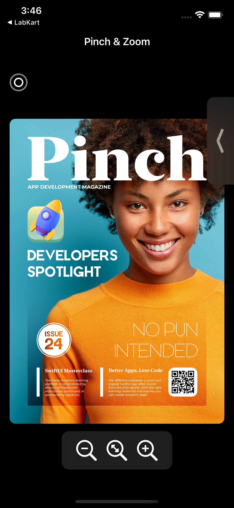
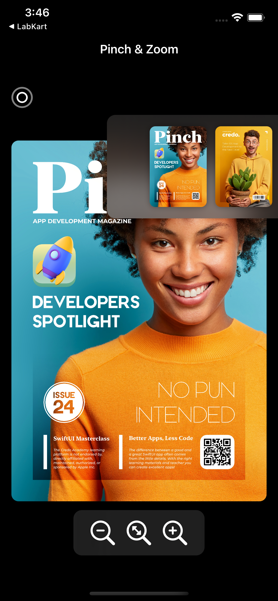

# Pinch_SwiftUI

---

<h2> 
  Full featured Zoom in & Out like app written in SwiftUI with MVC architecture.
</h2>

  
  
  

---

<h2>
  Features
</h2>

- Pinch to Zoom In & Out.
- Double Tap to Zoom In & Out.
- Dedicatied Zoom in & Out Buttons.
- Dedicated Button to bring back the image to default size.
- Tab to Switch between different Images.

---

<h2>
  Notes
</h2>

 User can zoom in & out and even select the image to be zoomed.

---

<h2>
  Watch Full Video
</h2>

<a href="https://drive.google.com/file/d/1qA55hdv31hVfSsnAvKeSvkFrQdFCEqdf/view?usp=drivesdk"> Click here to Watch the full Functionality. </a>

---
